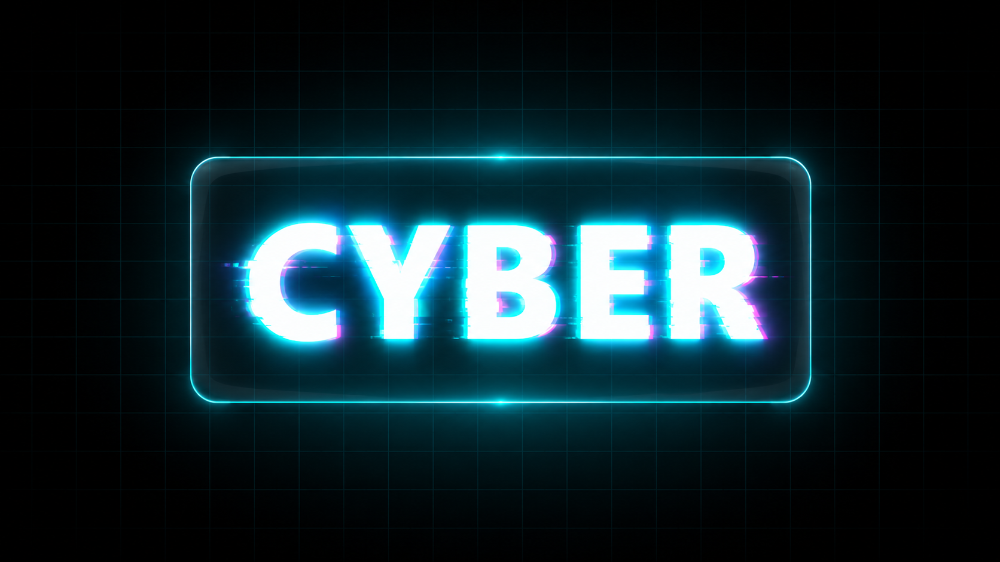

# 🚀 Futuristic Cyberpunk Glow Logo

A premium **Cyberpunk Glow Logo Animation** built using **HTML5**, **CSS3**, and **SVG Filters**. This project creates a futuristic neon logo with glowing effects, glitch distortion, glassmorphism, and subtle 3D perspective—all without using JavaScript.

Perfect for **landing pages, portfolios, gaming websites, tech brands, hero sections, and futuristic UI designs.**

---

## ✨ Features

- ⚡ Pure HTML5 & CSS3
- 🌈 Neon Glow Text Effect
- 🎭 SVG Filter-Based Glitch Animation
- 🔮 Glassmorphism UI Container
- 🎨 Modern Cyberpunk Color Palette
- 💎 Smooth Pulse Animation
- 🖥️ 3D Perspective Effect
- 📱 Fully Responsive Design
- 🚫 No JavaScript Required
- ⚙️ Lightweight & Easy to Customize

---

## 📸 Preview




## 🛠 Technologies Used

- HTML5
- CSS3
- SVG Filters
- CSS Variables
- CSS Animations
- CSS Grid
- CSS Transform
- CSS Perspective
- Backdrop Filter

---

## 📂 Project Structure

```text
Futuristic Cyberpunk Glow Logo/
│
├── index.html
├── style.css
├── glowLogo.mp4
└── README.md
```

---

## 🚀 Getting Started

### 1. Clone the Repository

```bash
git clone https://github.com/yourusername/Cyberpunk-Glow-Logo.git
```

### 2. Navigate to the Project Folder

```bash
cd Futuristic Cyberpunk Glow Logo
```

### 3. Open the Project

Simply open **index.html** in your favorite browser.

---

## 🎨 Customization

### Change the Logo Text

```html
<h1 class="logo-text" data-text="CYBER">
    CYBER
</h1>
```

Replace **CYBER** with your own brand name.

---

### Change Theme Colors

```css
:root{
    --bg-deep-space:#050508;
    --neon-cyan:#00f3ff;
    --neon-magenta:#ff0055;
    --neon-amber:#ffaa00;
}
```

---

### Increase or Reduce Glow

```css
text-shadow:
0 0 4px #fff,
0 0 10px var(--neon-cyan),
0 0 20px var(--neon-cyan),
0 0 40px var(--neon-cyan);
```

Adjust the values to create softer or stronger neon effects.

---

### Control the Glitch Effect

```html
<feDisplacementMap
    in="SourceGraphic"
    in2="noise"
    scale="18">
</feDisplacementMap>
```

Increase the `scale` value for a more dramatic glitch effect.

---

## 📱 Responsive Design

The project includes a mobile-friendly layout.

```css
@media (max-width:768px){
    .logo-text{
        font-size:3rem;
        letter-spacing:4px;
    }

    .relic-container{
        padding:2rem 3rem;
    }
}
```

---

## 📖 What You'll Learn

- SVG Filters
- CSS Variables
- CSS Animations
- Glassmorphism
- Neon Glow Effects
- Text Shadow Techniques
- CSS Perspective
- CSS Transform
- Responsive Web Design
- Modern UI Development

---

## 💡 Perfect For

- Landing Pages
- Portfolio Websites
- Gaming Websites
- Tech Startups
- Hero Sections
- Logo Animations
- Cyberpunk Interfaces
- Modern UI Practice
- Frontend Projects

---

## 🌐 Browser Support

| Browser | Supported |
|----------|-----------|
| Chrome | ✅ |
| Microsoft Edge | ✅ |
| Firefox | ✅ |
| Safari | ✅ |
| Opera | ✅ |

---

## 📈 Performance

- No JavaScript
- Lightweight
- Fast Rendering
- Optimized CSS Animations
- Hardware Accelerated Transforms

---

## 🤝 Contributing

Contributions are welcome!

1. Fork the repository.
2. Create your feature branch.

```bash
git checkout -b feature-name
```

3. Commit your changes.

```bash
git commit -m "Add new feature"
```

4. Push your branch.

```bash
git push origin feature-name
```

5. Open a Pull Request.

---

## 📄 License

Feel free to use, modify, and distribute it for personal or commercial projects.

---

## 👨‍💻 Author

**Tinesh Chasiya**

If you enjoyed this project, consider:

⭐ Starring the repository

🍴 Forking the project

📢 Sharing it with other developers

---

## 🔥 Related Topics

- HTML5
- CSS3
- SVG Filters
- CSS Animation
- Neon Effects
- Glitch Effect
- Cyberpunk UI
- Glassmorphism
- Responsive Design
- Frontend Development
- Modern Web Design
- UI Animation
- Creative Coding

---

## ⭐ Support

If you found this project useful, please give it a **⭐ Star** on GitHub.

Your support helps motivate future open-source projects and tutorials.

---

### Made with ❤️ using HTML & CSS